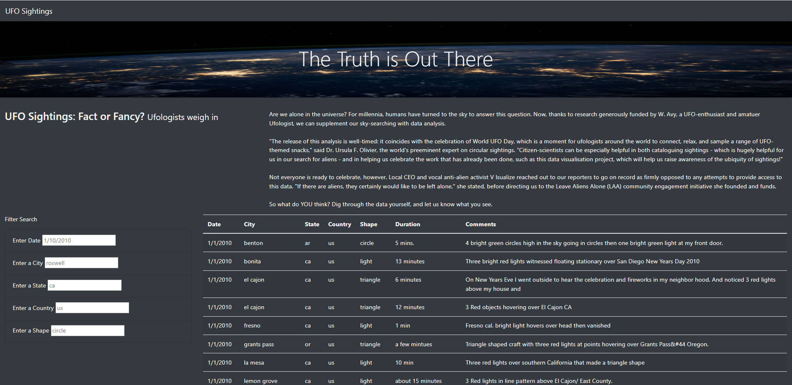
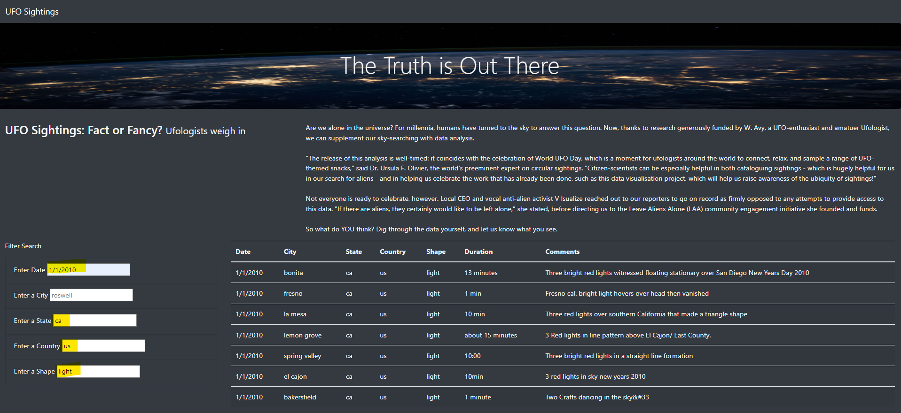

# UFOs

## 1. Overview of the analysis:
    UFO data was stored in JavaScript array which is not easy to understand. With help of JavaScript & HTML coding, web page & table is created which incorporated all the data. Depicted data can be filtered with five different categories. This filter provide very fast and easy way to organzied required data. JavaScript is used to improve HTML code to get data which can  change dynamically. We have also implemented bootstrap which help to provide easy manipulation of web page information.

## 2. Results:
    With help of JavaScript we can organized JavaScript UFO data in to the table on web page. it can also filtered with different five elements which provide the quick required information.
    a. web page with data table.

    b. Web page with filteration,
        1. Date.
        2. State.
        3. Country.
        4. Shape.

## 3. Summary:
* It is observed that JavaScript can provide very easy dynamical web page development. However we have observed web page become heavily populated on one page.

* 1. It is observed that data stored in the "duration" is not consistance which can be convert and stored properly for filteration.
  2. In this data set there is not images were stored, data might be more useful with images can be obtained and store with it.
